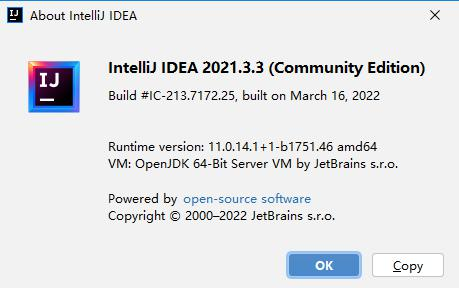
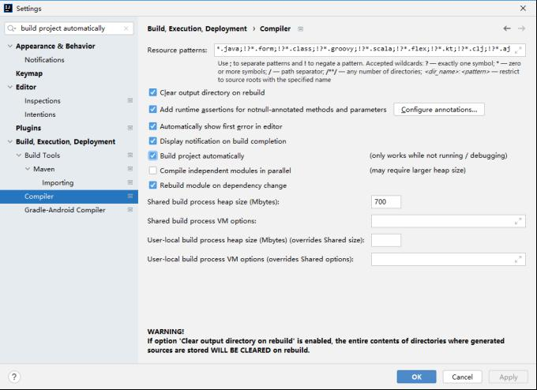
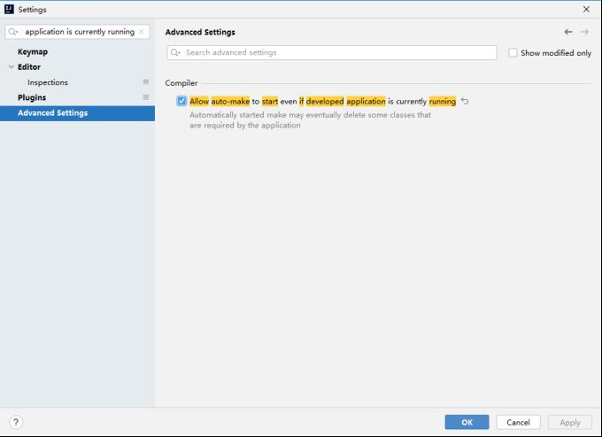

# hotswap-classloader: Dynamic Hot Reloading
[English](readme.md) | [中文](readme_cn.md)
## 1. Introduction

**hotswap-classloader** is a dynamic class loader based on the JVM. It utilizes the HotSwapWatcher and HotSwapClassloader technologies to dynamically detect modifications to class files. This project was inspired by the hot loading design of jfinal-undertow.
[See Reference](https://gitee.com/jfinal/jfinal-undertow/tree/master/src/main/java/com/jfinal/server/undertow/hotswap)

**Key Features:**
- Achieves rapid application hot reloading, with test results showing hot reloads completed in approximately 1 second.

**Loading Speed:**
- Upon integration with spring-boot, directly starting spring-boot in eclipse, and making changes to the controller followed by pressing Ctrl+S to save, the application will automatically restart and parse the class. The entire process completes within 1 second.

**Comparable Products:**
- springloaded
- spring-boot-devtools
- JRebel

## 2. Integration and Usage

### 2.1 Integration with spring-boot

1. **Add Dependency**
```xml
<dependency>
  <groupId>com.litongjava</groupId>
  <artifactId>hotswap-classloader</artifactId>
  <version>1.1.1</version>
</dependency>
```

2. **Add Configuration File**  
   Create a `config.properties` file under `src/main/resource/` and add the following content:
```
mode=dev
```

3. **Modify the Startup Class Code**  
   Replace `SpringApplication.run(Application.class, args);` with `SpringApplicationWrapper.run(Application.class, args);`.

Example:

```java
package com.litongjava.spring.boot.v216;

import org.springframework.boot.SpringApplication;
import org.springframework.boot.autoconfigure.SpringBootApplication;
import com.litongjava.hotswap.wrapper.spring.boot.SpringApplicationWrapper;

@SpringBootApplication
public class Application {
  public static void main(String[] args) {
    SpringApplicationWrapper.run(Application.class, args);
  }
}
```

Note: `SpringApplicationWrapper` reads the `mode` key value from the `config.properties` file. If the value is `dev`, it starts the hotswapwather to monitor class changes and enables hot reloading; otherwise, it does not activate.

Upon completing the above steps, you can refer to this project for integration:  
[View the integrated project](https://gitee.com/ppnt/java-ee-spring-boot-study/tree/master/maven/java-ee-spring-boot-2.1.6-study/java-ee-spring-boot-2.1.6-hello)

### 2.2 Support for IDEA

#### 2.2.1 Version Information
IDEA version is as follows:  


#### 2.2.2 Why Hot Reload Configuration is Needed
HotSwapWatcher mainly listens to modifications of class files under `target/classes` to trigger hot reloading. However, by default in IDEA, there is no automatic compilation, causing no changes to the files under `target/classes`. There are two solutions:
1. Use the Ctrl + F9 shortcut to trigger compilation. (Test failed in IntelliJ IDEA 2019.3.3 (Ultimate Edition))
2. Configure IDEA to enable automatic compilation, similar to eclipse.

#### 2.2.3 IDEA Hot Reload Settings

1. **Automatically Build Project**  
   Search for "compiler" in settings, then check "build project automatically".  
   

2. **Allow Automatic Building Even When a Development Application is Running**  
   Search for "make" in settings, then check "Allow auto-make to start even if developed application is currently running".  
   

3. **Adjust Delay Time**  
   Use the Ctrl+Shift+Alt+/ shortcut, select "Registry...", then adjust the following configurations:

- `compiler.automake.postpone.when.idle.less.than`: Default is 3000, change to 100.
- `compiler.automake.trigger.delay`: Default value is 3000, change to 100.
- `compiler.document.save.trigger.delay`: Default is 1500, change to 100.

4. **Cancel Automatic Code Saving**  
   In "File" -> "Settings" -> "Appearance & Behavior" -> "System Settings", uncheck the following options:

- Older versions: Uncheck "Save files on frame deactivation" and "Synchronize files on frame or editor tab activation".
- Newer versions: Uncheck "Save files if tab IDE is idle for 10 seconds" and "Save file when switching to a different application or a built-in terminal".

5. **Display "modified" Mark**  
   After modifying a file, a "star" mark will be displayed in the code editing window's tab area. Navigate to "File" -> "Settings" -> "Editor" -> "General" -> "Editor Tabs", then check "Mark modified(*)".

After completing the above settings, modifying a file and saving it in IDEA will result in the file being automatically compiled, and the application will automatically restart with hot reloading applied.

**Note**: There might be an issue when a package contains only one `.java` file. For more details, please check [here](https://jfinal.com/share/2436).

### 2.3 Support for spring-boot-maven-plugin

If you aim to start the spring-boot project from the command line using `mvn spring-boot:run`, the default class loader is `plexus-classworlds`. To use this class loader, you need to follow these steps:

1. Add the aforementioned dependency.
2. Modify the startup class.
3. Add the following configuration to `pom.xml` to enable plugin support for hot startup:

```xml
<plugin>
  <groupId>org.springframework.boot</groupId>
  <artifactId>spring-boot-maven-plugin</artifactId>
  <configuration>
    <includeSystemScope>true</includeSystemScope>
    <fork>true</fork>
    <mainClass>${start-class}</mainClass>
  </configuration>
</plugin>
```

4. Start the project using:
```
mvn spring-boot:run
```

## 3. Demonstrative Screenshots of Usage

### 3.1 Eclipse Testing Results
After starting spring-boot, adding a method to the controller, and pressing Ctrl+S to save, the HotSwapClassloader detects file changes and automatically reloads the code. This process is completed in approximately 0.8 seconds.


### 3.2 IDEA Testing Results

After starting spring-boot, adding a method to the controller, and pressing Ctrl+S to save, the HotSwapClassloader detects the file changes and automatically reloads the code. However, in IDEA, due to a compilation delay of about 10 seconds, the entire reloading process takes approximately 10.8 seconds.


### 3.3 Command Line Testing Results

When starting the project from the command line using `mvn spring-boot:run`, you can modify the code in eclipse or IDEA for testing. This test is based on a large project. A regular startup takes 9.5 seconds, while hot reloading takes 3.4 seconds.

[Click to view the video demonstration](https://www.ixigua.com/iframe/7091662497010156063?autoplay=0)

<iframe width="720" height="405" frameborder="0" src="https://www.ixigua.com/iframe/7091662497010156063?autoplay=0" referrerpolicy="unsafe-url" allowfullscreen></iframe>