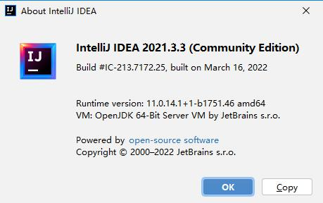
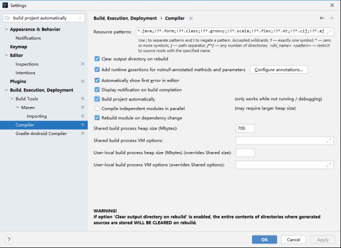
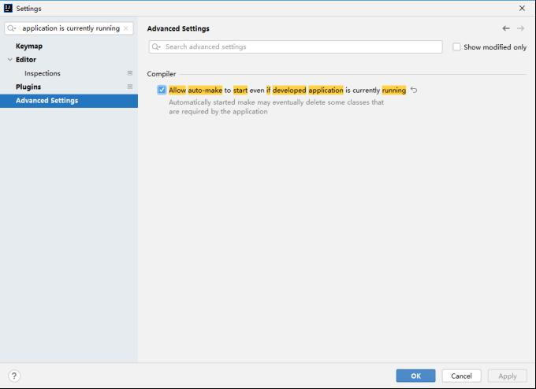

# hotswap-classloader：Java 类动态编译加载

[English](readme.md) | [中文](readme_cn.md)

## 1. 介绍

**hotswap-classloader** 是一个基于 JVM 的动态类加载器。它结合了 *HotSwapWatcher* 和 *HotSwapClassloader* 技术，能够实时监测 class 文件的变化并自动加载。该项目的设计灵感来源于 [jfinal-undertow](https://gitee.com/jfinal/jfinal-undertow/tree/master/src/main/java/com/jfinal/server/undertow/hotswap) 的热加载方案。

**主要功能：**

- 实现应用的快速热加载，测试中热加载过程约 1 秒内完成。
- 可与 tio-boot 无缝集成，满足各种框架下的动态加载需求。

**加载速度示例：**

- 集成至 spring-boot 后，在 Eclipse 中启动应用，修改 controller 后按 Ctrl+S 保存，应用会自动重启并加载最新 class 文件，整个过程仅需约 1 秒。

**对标产品：**

- springloaded
- spring-boot-devtools
- JRebel

---

## 2. 整合与使用

### 2.1 与 spring-boot 的整合

#### 1. 添加依赖

在你的 Maven 项目中添加如下依赖：

```xml
<dependency>
  <groupId>com.litongjava</groupId>
  <artifactId>hotswap-classloader</artifactId>
  <!-- 详情请见：https://central.sonatype.com/artifact/com.litongjava/hotswap-classloader -->
  <version>1.2.2/version</version>
</dependency>
```

#### 2. 添加配置文件

在 `src/main/resources/` 目录下创建 `config.properties` 文件，并添加如下内容：

```
mode=dev
```

#### 3. 修改启动类代码

将启动代码中的 `SpringApplication.run(Application.class, args);` 替换为 `SpringApplicationWrapper.run(Application.class, args);`。示例代码如下：

```java
package com.litongjava.spring.boot.v216;

import org.springframework.boot.SpringApplication;
import org.springframework.boot.autoconfigure.SpringBootApplication;
import com.litongjava.hotswap.wrapper.spring.boot.SpringApplicationWrapper;

@SpringBootApplication
public class Application {
  public static void main(String[] args) {
    SpringApplicationWrapper.run(Application.class, args);
  }
}
```

> **注意**：  
> `SpringApplicationWrapper` 会读取 `config.properties` 文件中的 `mode` 配置项。如果值为 `dev`，则启动 hotswap watcher 监听 class 文件的变化并启用热加载；否则将保持原有行为。

完成上述步骤后，可参考该工程了解整合效果：[查看整合后的工程](https://gitee.com/ppnt/java-ee-spring-boot-study/tree/master/maven/java-ee-spring-boot-2.1.6-study/java-ee-spring-boot-2.1.6-hello)

---

### 2.2 与其他外部框架的整合

在自定义的启动类中调用 `ForkApp.run` 方法即可实现热加载，示例如下：

```java
// 参数说明：框架启动类、启动参数、是否启用热加载、重启实现类
ForkApp.run(SklearnWebApp.class, args, true, new SelfRestart());
```

完整示例：

```java
package com.litongjava.tio.boot.djl;

import org.tio.utils.jfinal.P;
import com.litongjava.hotswap.wrapper.forkapp.ForkApp;

public class SklearnWebApp {

  public static void main(String[] args) throws Exception {
    long start = System.currentTimeMillis();
    // 初始化并启动服务器
    P.use("app.properties");
//    Diagnostic.setDebug(true);
//    TioApplicationWrapper.run(SklearnWebApp.class, args);
    ForkApp.run(SklearnWebApp.class, args, true, new SelfRestart());
    long end = System.currentTimeMillis();
    System.out.println("started: " + (end - start) + " (ms)");
  }
}
```

编写 `SelfRestart` 类，实现 `RestartServer` 接口中的方法：

```java
package com.litongjava.tio.boot.djl;

import com.litongjava.hotswap.debug.Diagnostic;
import com.litongjava.hotswap.kit.HotSwapUtils;
import com.litongjava.hotswap.server.RestartServer;
import com.litongjava.hotswap.wrapper.forkapp.ForkAppBootArgument;
import com.litongjava.tio.boot.TioApplication;
import com.litongjava.tio.boot.context.Context;
import lombok.extern.slf4j.Slf4j;

@Slf4j
public class SelfRestart implements RestartServer {
  
  @Override
  public boolean isStarted() {
    return ForkAppBootArgument.getContext().isRunning();
  }

  @Override
  public void restart() {
    System.err.println("loading");
    long start = System.currentTimeMillis();

    stop();
    // 获取新的 ClassLoader
    ClassLoader hotSwapClassLoader = HotSwapUtils.newClassLoader();
    if (Diagnostic.isDebug()) {
      log.info("new classLoader: {}", hotSwapClassLoader);
    }

    // 在启动新的 spring-boot 应用之前，必须设置当前线程的上下文 ClassLoader
    Thread.currentThread().setContextClassLoader(hotSwapClassLoader);

    // 获取启动类及启动参数
    Class<?> clazz = ForkAppBootArgument.getBootClazz();
    String[] args = ForkAppBootArgument.getArgs();
    // 启动应用
    start(clazz, args);
    
    long end = System.currentTimeMillis();
    System.err.println("Loading complete in " + (end - start) + " ms (^_^)\n");
  }

  @Override
  public void start(Class<?> primarySource, String[] args) {
    Context context = TioApplication.run(primarySource, args);
    ForkAppBootArgument.setContext(context);
  }

  @Override
  public void stop() {
    ForkAppBootArgument.getContext().close();
  }
}
```

---

## 3. 开发工具支持

### 3.1 IDEA 的支持

#### 3.2 IDEA 2021.1.3 版本支持

##### 3.2.1 版本信息

示例截图如下：  


##### 3.2.2 为什么需要额外配置

默认情况下，HotSwapWatcher 会监听 `target/classes` 下的 class 文件变动触发热加载。但是在 IDEA 中，默认不会自动编译，导致 `target/classes` 下的文件不会发生变化。解决方法有两种：

1. 使用快捷键 Ctrl+F9 进行手动编译。（在 IntelliJ IDEA 2019.3.3 Ultimate 版中测试失败）
2. 配置 IDEA 开启自动编译，类似 Eclipse 的体验。

##### 3.2.3 IDEA 热加载设置

1. **自动构建项目**  
   在 Settings 中搜索 “compiler”，勾选 “Build project automatically”。  
   

2. **允许应用运行时自动构建**  
   在 Settings 中搜索 “make”，勾选 “Allow auto-make to start even if developed application is currently running”。  
   

3. **调整延迟时间**  
   使用快捷键 Ctrl+Shift+Alt+/ 打开 “Registry...”，并修改以下配置项：

   - `compiler.automake.postpone.when.idle.less.than`：默认 3000，建议修改为 100。
   - `compiler.automake.trigger.delay`：默认 3000，建议修改为 100。
   - `compiler.document.save.trigger.delay`：默认 1500，建议修改为 100。

4. **取消自动保存设置**  
   进入 “File → Settings → Appearance & Behavior → System Settings”，取消以下选项：
   
   - 旧版本：取消 “Save files on frame deactivation” 和 “Synchronize files on frame or editor tab activation”。
   - 新版本：取消 “Save files if IDE tab is idle for 10 seconds” 和 “Save file when switching to a different application or a built-in terminal”。

5. **显示“已修改”标记**  
   在代码编辑区域的 Tab 上显示“星号”标记，具体路径为 “File → Settings → Editor → General → Editor Tabs”，勾选 “Mark modified(*)”。

配置完成后，当在 IDEA 中修改并保存文件时，系统会自动编译，应用随之重启并完成热加载。

> **注意**：  
> 当一个包中只有一个 `.java` 文件时，可能会出现问题，详情请参考 [这里](https://jfinal.com/share/2436)。

---

### 3.3 spring-boot-maven-plugin 支持

如果希望在命令行使用 `mvn spring-boot:run` 启动 spring-boot 项目，由于默认的类加载器为 `plexus-classworlds`，需要按以下步骤配置以支持热加载：

1. 添加上述 hotswap-classloader 依赖。
2. 修改启动类（参考 2.1 节）。
3. 在 `pom.xml` 中配置 spring-boot-maven-plugin：

   ```xml
   <plugin>
     <groupId>org.springframework.boot</groupId>
     <artifactId>spring-boot-maven-plugin</artifactId>
     <configuration>
       <includeSystemScope>true</includeSystemScope>
       <fork>true</fork>
       <mainClass>${start-class}</mainClass>
     </configuration>
   </plugin>
   ```

4. 使用 `mvn spring-boot:run` 启动项目即可。

---

### 3.4 Eclipse 与 Visual Studio Code

- **Eclipse**  
  原生支持热加载，无需额外配置。修改 Java 文件保存后会自动加载，开发体验优于 IDEA。

- **Visual Studio Code**  
  同样原生支持热加载，修改 Java 文件保存后自动加载，开发体验优于 IDEA。

---

## 4. 使用效果展示

### 4.1 Eclipse 测试效果

在 spring-boot 启动后，向 controller 添加新方法，并按 Ctrl+S 保存。HotSwapClassloader 检测到文件变化后，会自动重启加载新代码，整个过程约 0.8 秒内完成。


---

### 4.2 IDEA 测试效果

在 spring-boot 启动后，向 controller 添加新方法，并按 Ctrl+S 保存。HotSwapClassloader 检测到文件变化后自动重启加载代码。但由于 IDEA 编译存在约 10 秒的延迟，整体加载过程约需 10.8 秒。


---

### 4.3 命令行测试效果

使用命令行执行 `mvn spring-boot:run` 启动项目后，同样可以在 Eclipse 或 IDEA 中修改代码进行测试。示例项目中，完整启动时间约 9.5 秒，而热加载时间约 3.4 秒。

[点击查看视频效果](https://www.ixigua.com/iframe/7091662497010156063?autoplay=0)

<iframe width="720" height="405" frameborder="0" src="https://www.ixigua.com/iframe/7091662497010156063?autoplay=0" referrerpolicy="unsafe-url" allowfullscreen></iframe>