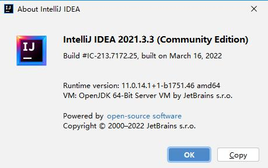

# hotswap-classloader: 动态热加载
[English](readme.md) | [中文](readme_cn.md)
## 1. 介绍

**hotswap-classloader** 是一个基于 JVM 的动态类加载器。它采用 HotSwapWatcher 和 HotSwapClassloader 技术，能够动态检测到 class 文件的修改。这个项目是受 jfinal-undertow 的热加载设计所启发的。
[查看参考](https://gitee.com/jfinal/jfinal-undertow/tree/master/src/main/java/com/jfinal/server/undertow/hotswap)

**主要功能：**
- 实现快速的应用热加载，测试热加载大约在1秒内完成。

**加载速度：**
- 集成到 spring-boot 之后，直接在 eclipse 中启动 spring-boot，修改 controller 后按 Ctrl+S 保存。该应用会自动重启并解析 class，整个过程在1秒内完成。

**对标产品：**
- springloaded
- spring-boot-devtools
- JRebel

## 2. 整合与使用

### 2.1 与 spring-boot 的整合

1. **添加依赖**
```xml
<dependency>
  <groupId>com.litongjava</groupId>
  <artifactId>hotswap-classloader</artifactId>
  <version>1.1.7</version>
</dependency>
```

2. **添加配置文件**  
   在 `src/main/resource/` 下创建 `config.properties` 文件并添加如下内容:
```
mode=dev
```

3. **修改启动类代码**  
   替换 `SpringApplication.run(Application.class, args);` 为 `SpringApplicationWrapper.run(Application.class, args);`。

示例如下:

```java
package com.litongjava.spring.boot.v216;

import org.springframework.boot.SpringApplication;
import org.springframework.boot.autoconfigure.SpringBootApplication;
import com.litongjava.hotswap.wrapper.spring.boot.SpringApplicationWrapper;

@SpringBootApplication
public class Application {
  public static void main(String[] args) {
    SpringApplicationWrapper.run(Application.class, args);
  }
}
```

注意：`SpringApplicationWrapper` 会读取 `config.properties` 文件中的 `mode` 键的值。如果值为 `dev`，则启动 hotswapwather 监听Class的变化并启用热加载，否则不启用。

完成以上步骤后，你可以参考此工程进行整合：  
[查看整合后的工程](https://gitee.com/ppnt/java-ee-spring-boot-study/tree/master/maven/java-ee-spring-boot-2.1.6-study/java-ee-spring-boot-2.1.6-hello)

### 2.2 整合其他外部框架
在自己的启动了中调用ForkApp.run
```
//参数 框架启动类,框架启动参数,是否启用热加载,重启类
ForkApp.run(SklearnWebApp.class, args, true, new SelfRestart());
```
示例
```
package com.litongjava.tio.boot.djl;

import org.tio.utils.jfinal.P;

import com.litongjava.hotswap.wrapper.forkapp.ForkApp;

public class SklearnWebApp {

  public static void main(String[] args) throws Exception {
    long start = System.currentTimeMillis();
    // 初始化服务器并启动服务器
    P.use("app.properties");
//     Diagnostic.setDebug(true);
//    TioApplicationWrapper.run(SklearnWebApp.class, args);
     ForkApp.run(SklearnWebApp.class, args, true, new SelfRestart());
    long end = System.currentTimeMillis();
    System.out.println("started:" + (end - start) + "(ms)");
  }
}
```
编写SelfRestart实现RestartServer中的方法

```
package com.litongjava.tio.boot.djl;

import com.litongjava.hotswap.debug.Diagnostic;
import com.litongjava.hotswap.kit.HotSwapUtils;
import com.litongjava.hotswap.server.RestartServer;
import com.litongjava.hotswap.wrapper.forkapp.ForkAppBootArgument;
import com.litongjava.tio.boot.TioApplication;
import com.litongjava.tio.boot.context.Context;

import lombok.extern.slf4j.Slf4j;

@Slf4j
public class SelfRestart implements RestartServer {
  public boolean isStarted() {
    return ForkAppBootArgument.getContext().isRunning();
  }

  public void restart() {
    System.err.println("loading");
    long start = System.currentTimeMillis();

    stop();
    // 获取一个新的ClassLoader
    ClassLoader hotSwapClassLoader = HotSwapUtils.newClassLoader();
    if (Diagnostic.isDebug()) {
      log.info("new classLoader:{}", hotSwapClassLoader);
    }

    // 在启动新的spring-boot应用之前必须设置上下文加载器
    Thread.currentThread().setContextClassLoader(hotSwapClassLoader);

    // 获取启动类和启动参数
    Class<?> clazz = ForkAppBootArgument.getBootClazz();
    String[] args = ForkAppBootArgument.getArgs();
    // 启动Application
    start(clazz, args);
    long end = System.currentTimeMillis();
    System.err.println("Loading complete in " + (end - start) + " ms (^_^)\n");
  }

  @Override
  public void start(Class<?> primarySource, String[] args) {
    Context context = TioApplication.run(primarySource, args);
    ForkAppBootArgument.setContext(context);
  }

  @Override
  public void stop() {
    ForkAppBootArgument.getContext().close();
  }
}
```
## 3.开发工具支持
### 3.1 IDEA 的支持

### 3.2 IDEA 2021.1.3 的支持
#### 3.2.1 版本信息
IDEA 版本如下：  


#### 3.2.2 为何需要热加载配置
HotSwapWatcher 主要是监听 `target/classes` 下的 class 文件修改来触发热加载。但在 IDEA 中，默认情况下不会自动编译，导致 `target/classes` 下的文件没有变化。有两种解决办法：
1. 使用快捷键 Ctrl + F9 触发编译。（在 IntelliJ IDEA 2019.3.3 (Ultimate Edition) 中测试失败）
2. 配置 IDEA 开启自动编译，类似 eclipse。

#### 3.2.3 IDEA 的热加载设置

1. **自动构建项目**  
   在 settings 中搜索 "compiler"，然后勾选 "build project automatically"。  
   

2. **允许开发应用运行时自动构建**  
   在 settings 中搜索 "make"，然后勾选 "Allow auto-make to start even if developed application is currently running"。  
   

3. **调整延迟时间**  
   使用 Ctrl+Shift+Alt+/ 组合键，选择 "Registry..."，然后调整以下配置：

- `compiler.automake.postpone.when.idle.less.than`：默认是3000，改为100。
- `compiler.automake.trigger.delay`：默认值是3000，改为100。
- `compiler.document.save.trigger.delay`：默认1500，改为100。

4. **取消代码自动保存**  
   在 "File" -> "Settings" -> "Appearance & Behavior" -> "System Settings" 中取消以下选项：

- 旧版本：取消 "Save files on frame deactivation" 和 "Synchronize files on frame or editor tab activation"。
- 新版本：取消 "Save files if tab IDE is idle for 10 seconds" 和 "Save file when switching to a different application or a built-in terminal"。

5. **显示 "modified" 标记**  
   修改文件后，在代码编辑窗口的 tab 区域会显示一个 "星号" 标记。路径为 "File" -> "Settings" -> "Editor" -> "General" -> "Editor Tabs"，然后勾选 "Mark modified(*)"。

完成以上设置后，在 IDEA 中修改文件并保存，文件会自动编译，应用会自动重启并热加载。

**注意**：当一个包中只有一个 `.java` 文件时，可能会出现问题。详情请查看 [这里](https://jfinal.com/share/2436)。

### 3.3 spring-boot-maven-plugin 支持

如果你想在命令行使用 `mvn spring-boot:run` 启动 spring-boot 项目，默认的类加载器是 `plexus-classworlds`。要使用这个类加载器，你需要按照以下步骤配置：

1. 添加上述依赖。
2. 修改启动类。
3. 在 `pom.xml` 中添加以下配置，使插件支持热启动：

```xml
<plugin>
  <groupId>org.springframework.boot</groupId>
  <artifactId>spring-boot-maven-plugin</artifactId>
  <configuration>
    <includeSystemScope>true</includeSystemScope>
    <fork>true</fork>
    <mainClass>${start-class}</mainClass>
  </configuration>
</plugin>
```

4. 使用 `mvn spring-boot:run` 启动项目。

### 1.4 Eclipse
不需要设置,原生支持.修改一个Java文件保存后会自动加载.开发体验优于IDEA
### 1.5 Visual Studio Code
不需要设置,原生支持.修改一个Java文件保存后会自动加载.开发体验优于IDEA
## 4. 使用效果截图

### 4.1 Eclipse 测试效果
在 spring-boot 启动后，向 controller 添加一个方法，按 Ctrl+S 保存。HotSwapClassloader 会检测到文件变化，自动重新加载代码，并在大约 0.8 秒内生效。


### 4.2 IDEA 测试效果

在 spring-boot 启动后，向 controller 添加一个方法，按 Ctrl+S 保存。HotSwapClassloader 会检测到文件变化，并自动重新加载代码。但在 IDEA 中，由于编译有约 10 秒的延迟，整个加载过程需要大约 10.8 秒才能完成。


### 4.3 命令行测试效果

在命令行使用 `mvn spring-boot:run` 启动项目后，你可以在 eclipse 或 IDEA 中修改代码进行测试。本测试是基于一个大型项目，正常启动需要 9.5 秒，而热加载则需要 3.4 秒。

[点击查看视频效果](https://www.ixigua.com/iframe/7091662497010156063?autoplay=0)

<iframe width="720" height="405" frameborder="0" src="https://www.ixigua.com/iframe/7091662497010156063?autoplay=0" referrerpolicy="unsafe-url" allowfullscreen></iframe>